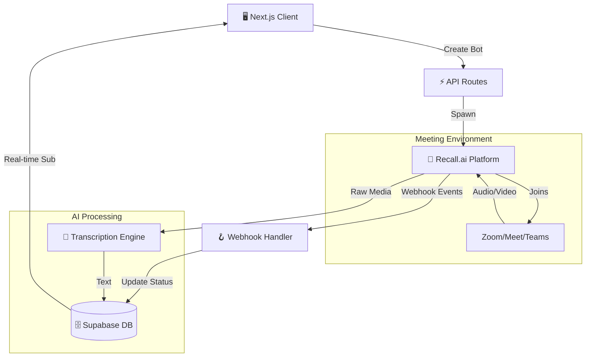

<div align="center">
  <h1>Np</h1>
  <p><strong>Intelligent Meeting Agent & Automated Archivist</strong></p>
  
  [](https://nextjs.org/)
  [](https://supabase.com/)
  [](https://www.typescriptlang.org/)
  []()
</div>

---

## ⚡ Overview

**Np** is an autonomous AI agent designed to live inside your meetings. It doesn't just record; it participates.

*   **👻 Silent Observer:** Spawns a bot that seamlessly joins your Zoom, Google Meet, or Teams calls.
*   **🎥 Intelligent Recording:** Captures high-quality audio and video without disrupting the flow.
*   **🧠 Active Participant:** Capable of answering questions directly within the meeting context (coming soon).
*   **📝 Auto-Transcription:** Generates speaker-diarized transcripts and summaries instantly.

## 🏗️ Architecture

Np follows an event-driven, serverless architecture to ensure scalability and real-time responsiveness.



### Core Components

1.  **Bot Orchestrator (`/app/api/create-bot`)**: Handles the initialization and configuration of meeting bots.
2.  **Event Bus (`/app/api/webhook`)**: A robust webhook listener that processes real-time events from the bot (joined, left, recording_started).
3.  **Data Layer (Supabase)**: Stores bot states, transcripts, and meeting metadata with real-time subscriptions enabled for the frontend.
4.  **Frontend (Next.js + Tailwind)**: A modern, dark-themed dashboard for managing bots and viewing insights.

## 🚀 Quick Start

### Prerequisites
*   Node.js 18+
*   Supabase Account
*   Recall.ai API Key

### Installation

1.  **Clone the repository**
    ```bash
    git clone https://github.com/N-PCs/urMeetings.git
    cd urMeetings/AI-Bot
    ```

2.  **Install dependencies**
    ```bash
    npm install
    ```

3.  **Environment Setup**
    Create a `.env.local` file:
    ```env
    NEXT_PUBLIC_SUPABASE_URL=your_sb_url
    NEXT_PUBLIC_SUPABASE_ANON_KEY=your_sb_key
    RECALL_AI_API_TOKEN=your_recall_token
    ```

4.  **Run Development Server**
    ```bash
    npm run dev
    ```

## 🛠️ API Reference

| Method | Endpoint | Description |
| :--- | :--- | :--- |
| `POST` | `/api/create-bot` | Spawns a new bot instance into a meeting URL. |
| `GET` | `/api/fetch-bot` | Retrieves current status and recording links. |
| `POST` | `/api/webhook` | Receives async events from the bot infrastructure. |

---

<div align="center">
  <sub>Built by Neel P (N-PCs)</sub>
</div>
