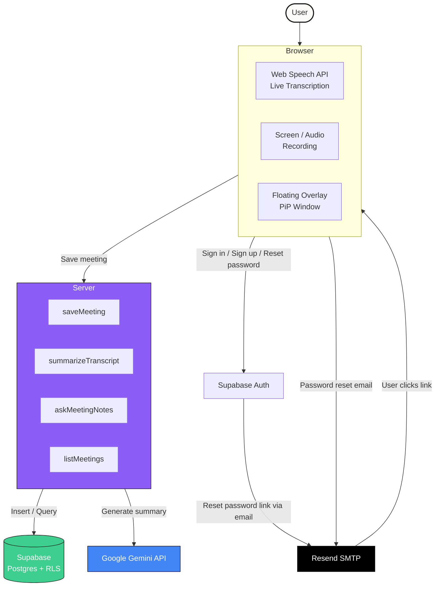
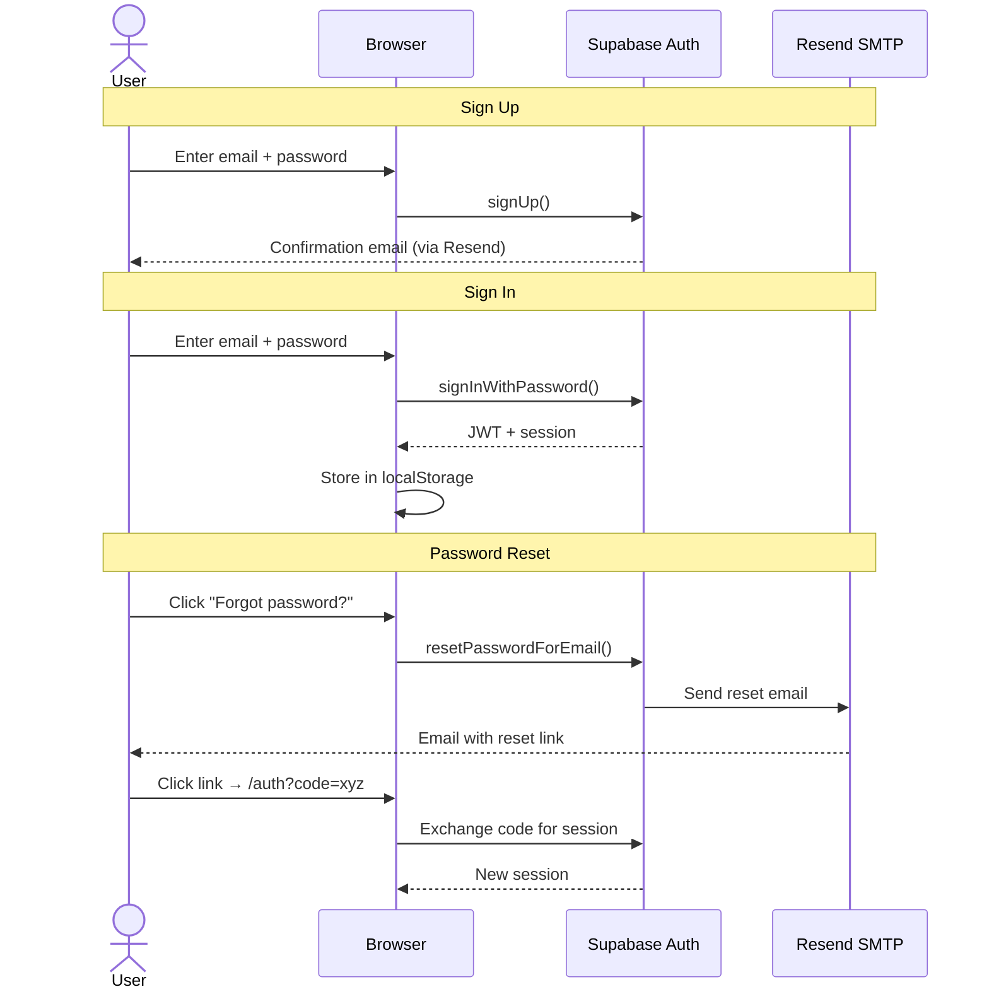

<div align="center">

[](https://vercel.com/new/clone?repository-url=https://github.com/N-PCs/urMeetings)

</div>

# urMeetings

### AI meeting notes that actually help

Record meetings in your browser, get instant AI summaries and action items, and ask questions across everything you've said.


</div>

---

## Features

| Feature | Description |
|---------|-------------|
| **Live Transcription** | Real-time speech-to-text using the browser's Web Speech API — no API key needed |
| **AI Bot Join** | Paste a Google Meet / Zoom / Teams link and our AI bot joins, transcribes, and summarizes |
| **Screen + Audio Recording** | Record full screen video (`.webm`) or audio-only with AI-powered speaker diarization |
| **AI Summaries** | Instant executive summaries with key decisions and action items via Google Gemini |
| **Ask Your Notes** | Natural-language Q&A across all your saved meetings |
| **Password Recovery** | Full password reset flow via Resend SMTP |
| **Floating Overlay** | Draggable, resizable PiP window — use across browser tabs |
| **Markdown Export** | Download any meeting note as a clean `.md` file |
| **Mobile-First** | Bottom tab bar on phones, sidebar on desktop |

---

## Tech Stack

| Layer | Technology | Free Tier |
|-------|-----------|-----------|
| Framework | [TanStack Start](https://tanstack.com/start) + React 19 + Tailwind v4 | Yes |
| UI | [shadcn/ui](https://ui.shadcn.com) + Radix primitives | Yes |
| Auth + Database | [Supabase](https://supabase.com) (Postgres, RLS, Auth) | 500 MB DB, 50k MAU |
| AI | [Google Gemini](https://aistudio.google.com) (`gemini-2.5-flash`) | ~15 req/min |
| Transactional Email | [Resend](https://resend.com) (SMTP for password reset) | 100 emails/day |
| Hosting | [Vercel](https://vercel.com) (Hobby tier) | 100 GB bandwidth/mo |
| Live Transcription | Web Speech API (browser-native) | Free forever |
| Search | Postgres FTS (`tsvector` + GIN index) | Free (built into Supabase) |

**Total cost: $0** for personal use.

---

## How It Works



### Auth Flow



---

## Getting Started

### Prerequisites

- [Node.js](https://nodejs.org) 18+ or [Bun](https://bun.sh)
- A [Supabase](https://supabase.com) project
- A [Google Gemini](https://aistudio.google.com/app/apikey) API key
- A [Resend](https://resend.com) account (for password reset emails)

### 1. Clone & Install

```bash
git clone https://github.com/N-PCs/urMeetings.git
cd urMeetings
bun install   # or npm install
```

### 2. Environment Variables

```bash
cp .env.example .env.local
```

Fill in `.env.local`:

```env
SUPABASE_URL="https://your-project.supabase.co"
SUPABASE_PUBLISHABLE_KEY="sb_publishable_xxx"
SUPABASE_PROJECT_ID="your-project-id"

VITE_SUPABASE_URL="https://your-project.supabase.co"
VITE_SUPABASE_PUBLISHABLE_KEY="sb_publishable_xxx"
VITE_SUPABASE_PROJECT_ID="your-project-id"

GEMINI_API_KEY="your-gemini-api-key"
```

### 3. Database Setup

Go to your Supabase dashboard → **SQL Editor** → paste and run the contents of:

```
supabase/migrations/20260720140751_859a4d90-c568-4b34-a7e4-5ceaf302d4d3.sql
```

This creates the `meetings` table with RLS policies, full-text search indexes, and auto-updating timestamps.

### 4. Run Locally

```bash
bun run dev
```

Open [http://localhost:8080](http://localhost:8080)

---

## Supabase Setup (Password Recovery)

### URL Configuration

1. Supabase Dashboard → **Authentication** → **URL Configuration**
2. Set **Site URL** to your deployed URL:
   ```
   https://urmeetings.vercel.app
   ```
3. Add **Redirect URLs**:
   ```
   https://urmeetings.vercel.app/auth
   https://urmeetings.vercel.app/notes
   ```
4. Click **Save**

### Custom SMTP (Resend)

1. Create a free account at [resend.com](https://resend.com)
2. Go to **API Keys** → **Create API Key** → copy the key
3. In Supabase Dashboard → **Project Settings** → **Authentication** → **SMTP Settings**
4. Enable **Custom SMTP** and fill in:

| Field | Value |
|-------|-------|
| Sender email | `onboarding@resend.dev` |
| Sender name | `urMeetings` |
| Host | `smtp.resend.com` |
| Port | `465` |
| Username | `resend` |
| Password | Your Resend API key (`re_xxx...`) |

5. Click **Save**

---

## Deploy to Vercel

1. Push this repo to GitHub
2. Go to [vercel.com/new](https://vercel.com/new) → import the repo
3. Vercel auto-detects `vercel.json` (build: `NITRO_PRESET=vercel`)
4. In **Settings → Environment Variables**, add all vars from `.env.local`
5. Deploy

Vercel will auto-deploy on every push to `main`.

---

## Project Structure

```
urMeetings/
├── src/
│   ├── routes/
│   │   ├── __root.tsx              # App shell, providers, global layout
│   │   ├── auth.tsx                # Sign in / Sign up / Password reset
│   │   ├── index.tsx               # Landing page
│   │   ├── live.tsx                # Live meeting transcription
│   │   ├── features.tsx            # Features showcase
│   │   ├── _authenticated/
│   │   │   ├── route.tsx           # Auth gate (redirects to /auth if not signed in)
│   │   │   ├── notes.tsx           # Saved meetings list
│   │   │   ├── notes.$id.tsx       # Meeting detail + edit + export
│   │   │   ├── ask.tsx             # AI Q&A across meetings
│   │   │   ├── bot.tsx             # AI Bot join + audio/video upload
│   │   │   └── settings.tsx        # Account, avatar, preferences
│   │   └── ...
│   ├── components/
│   │   ├── app-shell.tsx           # Navigation sidebar + mobile tabs
│   │   ├── floating-overlay.tsx    # Draggable PiP overlay
│   │   ├── LiveMeeting.tsx         # Live transcription UI
│   │   └── AudioFileUpload.tsx     # Audio/video file upload + transcribe
│   ├── hooks/
│   │   ├── use-session.ts          # Supabase auth session hook
│   │   ├── use-meeting-listener.ts # Audio/screen recording + speech recognition
│   │   └── use-overlay-preference.ts
│   ├── integrations/
│   │   └── supabase/
│   │       ├── client.ts           # Browser Supabase client
│   │       ├── client.server.ts    # Server-side admin client (service role)
│   │       ├── auth-middleware.ts   # Server function auth verification
│   │       ├── auth-attacher.ts    # Client-side Bearer token attachment
│   │       └── types.ts            # Generated database types
│   └── lib/
│       ├── meetings.functions.ts   # All server functions (CRUD + AI)
│       └── utils.ts
├── supabase/
│   └── migrations/                 # Database schema + RLS policies
├── vercel.json                     # Vercel deployment config
├── vite.config.ts                  # Vite + TanStack Start config
└── SETUP.md                        # Detailed self-hosted setup guide
```

---

## Security

- **Row Level Security (RLS)** on all tables — users can only access their own data
- **Defense-in-depth** — server functions filter by `user_id` in addition to RLS
- **Input validation** via Zod schemas on all server function inputs
- **Bearer token auth** — server functions verify JWTs via Supabase auth middleware
- **Chrome autofill fix** — `onInput` + `onAnimationStart` handlers sync DOM values into React state
- **No secrets in client bundle** — GEMINI_API_KEY and service role keys stay server-side only

---

## Costs

| Service | Free Tier | Risk |
|---------|-----------|------|
| Supabase | 500 MB DB, 50k MAU | None at personal scale |
| Google Gemini | ~15 req/min on Flash | 429 on overflow, no card on file |
| Resend | 100 emails/day | None at personal scale |
| Vercel Hobby | 100 GB bandwidth/mo | None unless you upgrade |
| Web Speech API | Unlimited (browser) | None |

**Expected total: $0**

---

## License

MIT

---

<div align="center">

Made by **[Neel Pandey](https://github.com/N-PCs)**

</div>
